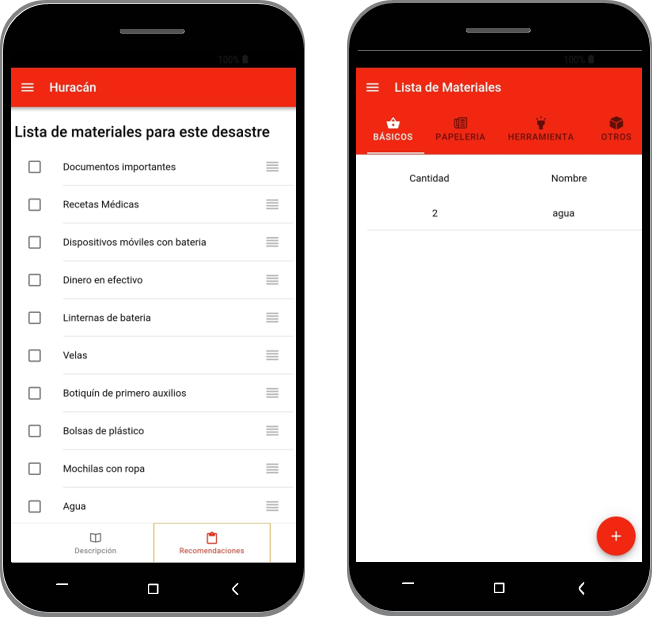
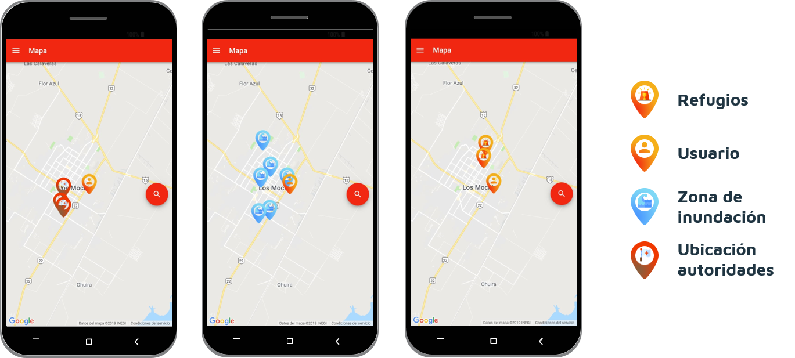
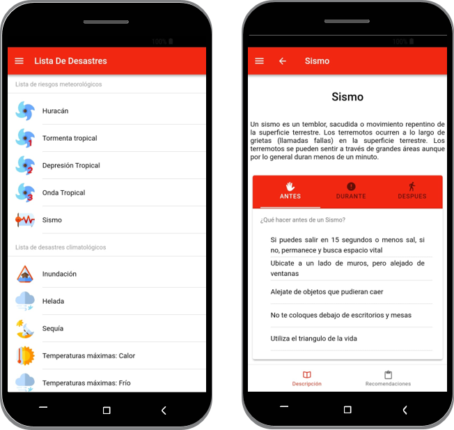
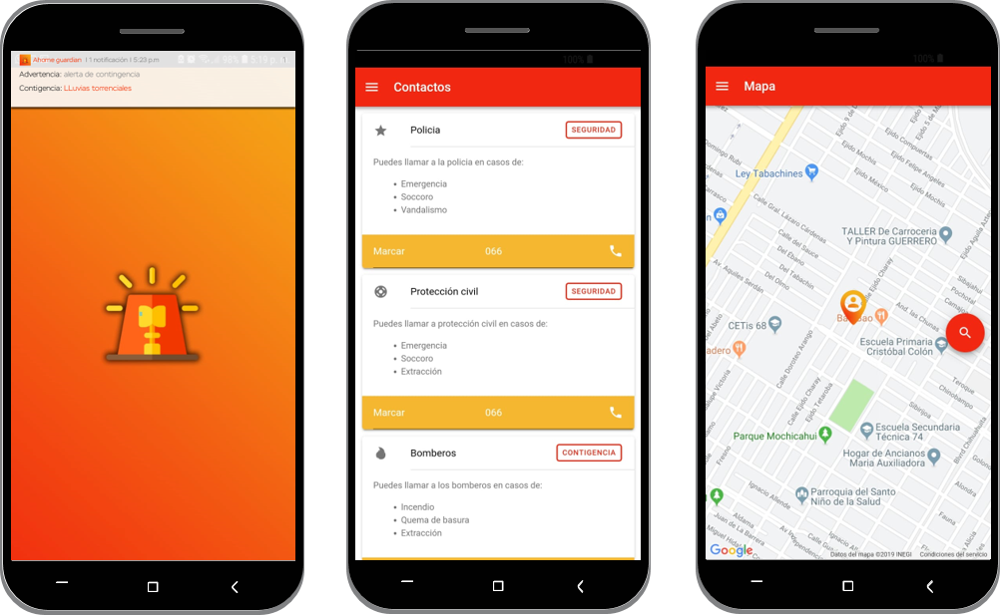

# desastres-naturales
## Ahome Alerta

Ionic 4 - mobile app

App desarrollada para el Municipio de Ahome a la dependencia de desarrollo urbano, con el fin de informar a la ciudadanía de los desastres naturales que pueden afectarnos en la ciudad, los cuidados que debemos tener y donde se encuentran los principales albergues de la ciudad.

## Background
La iniciativa nace en un evento de space apps challenge

## Problema
La falta de una herramienta tecnológica que nos informe y apoye, antes durante y después de una contingencia que pueda suscitar en Ahome.

## Antecedentes
- Depresión tropical “19E” septiembre del 2018
- Inundación con 39367.45 m2 de superficie cubierta, mas de 10 eventos en un periodo de 5 años
- Tormentas, depresiones, huracanes, crecientes, inundaciones, temperaturas máximas, heladas, sismos, sequías.

## Retos
### Que vamos a atacar
- Desinformación
- Datos al momento para el ciudadano
- Métricas para el gobierno
- Herramienta de apoyo ante contingencia

## Población objetivo

### Estudiantes
Será importante que estudiantes desde cualquier grado puedan tener acceso y uso de la aplicación para que conozcan los desastres que pueden sucitarse en la región y sepan como actuar ante la contingencia.

### Población general
La población en general también tendrá a disposición la aplicación para poder usar la herramienta en caso de ser requerido.

# Solución

## App Móvil
### Optamos un estilo fresco y nuevopara atraer la atención.

En cuanto a funcionalidades y a herramientas como el mapa, botones flotantes, y listas.

# Primera etapa del proyecto 

# Funcionalidades:
## Lista de materiales
El ciudadano podrá ver cuales son los materiales que debe tener ante las contingencias de la región.

## Ubicación de puntos
Podrá ubicar en ahome donde se encuentran los albergues de la ciudad, puntos de mayor inundación de la ciudad y ubicación de las autoridades.

## Información general
Información general acerca del desastre natural, recomendación para antes, durante y despúes.

## Hacer lista de materiales
El ciudadano podrá ver cuales son los materiales que debe tener ante las contingencias de la región.

## Contácto rápido con autoridades
El ciudadano podrá llamar rápidamente a las autoridades en caso de requerir apoyo.

## Obtención de datos.
Cada que un ciudadano solicite  ayuda atráves de la app, se registrará su ubicación geo referenciada para futuros estudios.

## Notificación ante desastre natural
Cada que se aproxime un desastre natural a los portadores de la aplicación, les llegarán notificaciones a su celular para que se preparen.

## Disponible para IOS y Android
Cualquier dispositivo que tenga android o IOS podrá hacer uso de la app.

## Sin uso de internet
Algunas funcionalidades de la app no requieren de conectividad a internet.

## Ahome Alerta

## Interfaz Lista de materiales:

## Interfaz Puntos de ubicación:

## Interfaz Información general:

## Interfaz Notificacion ante desastre natural. Contacto rápido ante autoridades. Obtención de datos:

# Cubrimos los problemas del reto

## Desinformación
Cubrimos la necesidad por medio de la diferente información que desplegamos en el mapa y en las listas.
## Información al momento
El ciudadano al momento de tener la aplicaci´pon puede disponer de todos los datos que se vayan a presentar cuando el quiera.

## Datos para el gobierno
Podemos saber donde se ha pedido ayuda y cuales son los sectores más vulnerables.
## Herramienta de apoyo ante contingencia
Toda la aplicación cumple la función de ser una herramienta de apoyo.

# Retos por afrontar

## Exportación de información a redes sociales

## Notificación y control por Protección Civil

## Glosario de términos y galerías

## Más datos para estudios

## Explicación más detallada en mapa

# ¿Qué necesitamos?

## Servidores
Almacenamiento de la información, integración en app store y play store.

## Operación
Mantenimiento, actualizaciones, mejoras, etc.

## Equipo
Necesitamos de equipo para poder realizar el proyecto tanto en ios como Android.

